# 🤖 Invoice Analysis AI Agent

[](https://n8n.io/)
[](https://openai.com/)
[]()

> **An autonomous n8n agent that analyzes financial CSV data and answers questions via chat.**

This workflow acts as an intelligent financial assistant. Instead of manually combing through spreadsheets, this agent automatically downloads Brazilian invoice data (*Notas Fiscais*), calculates key statistics, and uses **OpenAI** to answer your questions in natural language.

*Created for the "Grupo Mentes Autônomas" activity.*

---

## ⚡ Key Features

This agent transforms raw CSV files into actionable insights:

* **🔄 Automated ETL:** Downloads ZIP files from Google Drive, unzips, and processes headers & items.
* **🔗 Data Unification:** Intelligently merges invoice headers with their specific product items.
* **📊 Real-time Analytics:** Calculates total volume, counts, and identifies top performers.
* **💬 Natural Language Query:** Just ask questions in plain English or Portuguese.

---

## 🧠 Workflow Architecture

Below is the logic flow of how the agent processes your request:

```mermaid
graph TD
    A["💬 Start Chat"] -->|"User asks question"| B("☁️ Download ZIP from Drive")
    B --> C{"📂 Unzip & Split Files"}
    C -->|"Header CSV"| D["Convert to JSON"]
    C -->|"Items CSV"| E["Convert to JSON"]
    D --> F{"🔄 Merge Data"}
    E --> F
    F -->|"Unified Data"| G["🧮 Calculate Stats (JS)"]
    G -->|"Stats + Question"| H["🧠 OpenAI / LLM"]
    H --> I["🚀 Reply to User"]
```



---

## 🛠️ Setup & Installation

To run this workflow on your own n8n instance:

### 1. Prerequisites

You need an active n8n instance and the following accounts:

* **Google Cloud Project:** With Drive API enabled.
* **OpenAI Platform:** With an active API Key.

### 2. Import the Workflow

1. Download the `workflow.json` file from this repository.
2. Open your n8n dashboard.
3. Click **Add Workflow** > **Import from File**.

### 3. Configure Credentials

Update the nodes with your own credentials:

* **Google Drive OAuth2:** Required in the `Pega o ZIP com CSVs` node.
* **OpenAI API:** Required in the `OpenAI` node.

> **⚠️ Note:** Ensure the Google Drive file ID inside the HTTP Request node is accessible by the account you authenticated with.

---

## 💬 Usage Examples

Once the workflow is active, open the **Chat** interface in n8n and try these prompts:

* "How many unique suppliers are in the dataset?"
* "Which supplier received the highest amount?"
* "What is the total value of all invoices?"
* "Qual o produto com maior volume de entrega?" *(Works in Portuguese too!)*

---

## 🧩 Tech Stack

* **Orchestration:** n8n
* **Intelligence:** OpenAI GPT-4o-mini
* **Storage:** Google Drive
* **Scripting:** JavaScript (Node.js)

---

<p align="center">
</p>

```

```
